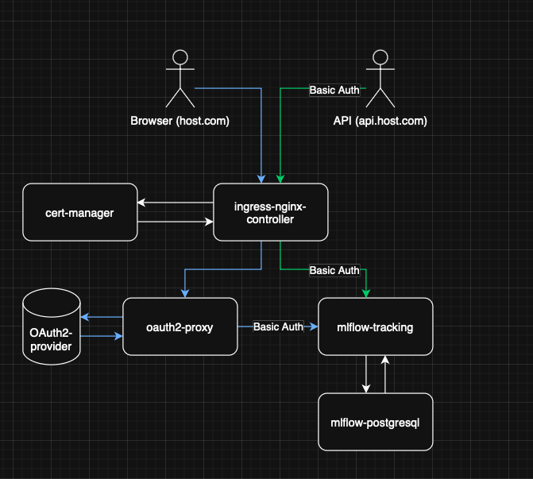

# MLflow on Kubernetes


A production-ready MLflow deployment on Kubernetes with OAuth2 authentication, SSL certificates, and Google Cloud Storage integration.

## Architecture Overview



This project deploys a secure, scalable MLflow tracking server on Kubernetes with the following components:

### Core Components

- **MLflow Tracking Server**: The main MLflow application for experiment tracking and model registry
- **PostgreSQL Database**: Stores MLflow metadata, experiments, runs, and model information
- **OAuth2 Proxy**: Provides GitHub OAuth2 authentication layer for secure access
- **NGINX Ingress Controller**: Routes external traffic and handles load balancing
- **Cert-Manager**: Automatically provisions and manages SSL/TLS certificates from Let's Encrypt

### Storage & Security

- **Google Cloud Storage (GCS)**: Stores MLflow artifacts (models, plots, files) with high availability
- **Kubernetes Secrets**: Securely manages credentials for database, OAuth2, and GCS access
- **Let's Encrypt SSL**: Provides free, automatically renewed SSL certificates

### Workflow

1. **User Authentication**: Users access MLflow through GitHub OAuth2 authentication
2. **Request Routing**: NGINX Ingress routes authenticated requests to appropriate services
3. **Data Storage**: MLflow stores metadata in PostgreSQL and artifacts in Google Cloud Storage
4. **API Access**: Direct API access available through separate domain for programmatic usage

## Project Structure

```
mlflow-on-k8s/
├── k8s/                              # Kubernetes configuration files
│   ├── mlflow-values.yaml           # Helm values for MLflow deployment
│   ├── oauth2-proxy.yaml     # OAuth2 proxy deployment configuration
│   ├── oauth2-proxy-alpha-config.yaml # Provides args for OAuth2 proxy service
│   ├── ingress.yaml                 # NGINX ingress rules and SSL configuration
│   └── cluster-issuer.yaml          # Cert-manager Let's Encrypt configuration
├── secrets/                          # Kubernetes secrets (examples and actual)
│   ├── mlflow-creds.example.yaml    # MLflow admin credentials template
│   ├── oauth2-creds.example.yaml    # OAuth2 client credentials template
│   ├── oauth2-mlflow-creds.example.yaml # OAuth2-MLflow bridge credentials template
│   ├── postgres-creds.example.yaml  # PostgreSQL credentials template
│   └── *.yaml                       # Actual secret files (gitignored)
├── scripts/                          # Utility scripts
│   └── prune_pv.sh                  # Script to clean up persistent volumes
├── readme/                           # Documentation assets
│   └── main.png                     # Architecture diagram
└── README.md                         # This file
```

## Setup Tutorial

### 1. Setup Kubernetes Cluster

If you don't have a Kubernetes cluster, create one using Google Kubernetes Engine (user your zone):

```bash

# Create GKE cluster
gcloud container clusters create mlflow-cluster \
    --zone=europe-west4-a \
    --num-nodes=1 \
    --machine-type=e2-standard-2

# Get cluster credentials
gcloud container clusters get-credentials mlflow-cluster --zone=europe-west4-a
```

### 2. Setup Google Cloud Storage and Service Account

Create a GCS bucket and service account for artifact storage:

```bash
# Create GCS bucket
gsutil mb gs://your-mlflow-bucket-name

# Create service account
gcloud iam service-accounts create mlflow-gcs-sa \
    --display-name="MLflow GCS Service Account"

# Grant storage permissions
gcloud projects add-iam-policy-binding YOUR_PROJECT_ID \
    --member="serviceAccount:mlflow-gcs-sa@YOUR_PROJECT_ID.iam.gserviceaccount.com" \
    --role="roles/storage.admin"

# Download service account key
gcloud iam service-accounts keys create gcs-key.json \
    --iam-account=mlflow-gcs-sa@YOUR_PROJECT_ID.iam.gserviceaccount.com

# Create Kubernetes secret for GCS credentials
kubectl create secret generic gcs-creds --from-file=gcs.json=gcs-key.json
```

### 3. Create GitHub OAuth2 Application

1. Go to GitHub Settings → Developer settings → OAuth Apps
2. Click "New OAuth App"
3. Fill in the details:
   - **Application name**: MLflow Tracking
   - **Homepage URL**: `https://your-domain.com`
   - **Authorization callback URL**: `https://your-domain.com/oauth2/callback`
4. Note down the **Client ID** and **Client Secret**

**Important**: You need a proper domain name (not raw IP) for OAuth2 to work correctly.

### 4. Create Kubernetes Secrets

Generate all required secrets in the `secrets/` folder:

```bash
# Generate cookie secret (24 random bytes, base64 encoded)
python3 -c "import secrets, base64; print(base64.b64encode(secrets.token_bytes(24)).decode())"

# Generate random passwords
openssl rand -base64 32
```

Create the secret files based on examples:

```bash
# Copy example files and fill in actual values
cp secrets/mlflow-creds.example.yaml secrets/mlflow-creds.yaml
cp secrets/oauth2-creds.example.yaml secrets/oauth2-creds.yaml
cp secrets/oauth2-mlflow-creds.example.yaml secrets/oauth2-mlflow-creds.yaml
cp secrets/postgres-creds.example.yaml secrets/postgres-creds.yaml

# Edit each file with your actual credentials
# Apply secrets to cluster
kubectl apply -f secrets/
```

### 5. Install NGINX Ingress Controller

```bash
# Add NGINX Helm repository
helm repo add ingress-nginx https://kubernetes.github.io/ingress-nginx
helm repo update

# Install NGINX Ingress Controller
helm install ingress-nginx ingress-nginx/ingress-nginx \
    --create-namespace \
    --namespace ingress-nginx

# Wait for external IP
kubectl get service ingress-nginx-controller -n ingress-nginx -w
```

Update your DNS records to point your domains to the external IP.

Edit `k8s/ingress.yaml` and replace `mlflow.pp.ua` and `api.mlflow.pp.ua` with your domains.

```bash
# Apply ingress configuration
kubectl apply -f k8s/ingress.yaml
```

### 6. Install Cert-Manager

```bash
# Add Jetstack Helm repository
helm repo add jetstack https://charts.jetstack.io
helm repo update

# Install cert-manager
helm install cert-manager jetstack/cert-manager \
    --namespace cert-manager \
    --create-namespace \
    --version v1.13.0 \
    --set installCRDs=true
```

Edit `k8s/cluster-issuer.yaml` and replace the email address with your own:

```bash
# Apply cluster issuer configuration
kubectl apply -f k8s/cluster-issuer.yaml
```

### 7. Install MLflow

```bash
# Add Bitnami Helm repository
helm repo add bitnami https://charts.bitnami.com/bitnami
helm repo update

# Edit k8s/mlflow-values.yaml and replace the bucket name
# Update defaultArtifactRoot: gs://your-mlflow-bucket-name/artifacts

# Install MLflow
helm install mlflow bitnami/mlflow -f k8s/mlflow-values.yaml
```

### 8. Install OAuth2 Proxy

Edit `k8s/oauth2-proxy-alpha-config.yaml` and replace the `clientID` with your GitHub OAuth2 client ID:

```bash
# Apply OAuth2 proxy configuration
kubectl apply -f k8s/oauth2-proxy-alpha-config.yaml
kubectl apply -f k8s/oauth2-proxy.yaml
```

### 9. Setup MLflow User Account

Create a user account in MLflow with proper permissions:

```bash
# Get MLflow admin credentials
kubectl get secret mlflow-creds -o jsonpath='{.data.admin-user}' | base64 -d
kubectl get secret mlflow-creds -o jsonpath='{.data.admin-password}' | base64 -d

# Get OAuth2-MLflow bridge credentials
kubectl get secret oauth2-mlflow-creds -o jsonpath='{.data.basic-username}' | base64 -d
kubectl get secret oauth2-mlflow-creds -o jsonpath='{.data.basic-password}' | base64 -d
```

Use [documentation](https://mlflow.org/docs/latest/ml/auth/#experiment-permissions) to log in with admin credentials and create a new user with:
   - **Username**: Your email address (same as GitHub)
   - **Password**: The password from `oauth2-mlflow-creds`
   - **Permission**: READ (or appropriate level)

Example:
```python
from mlflow.server import get_app_client
from mlflow import MlflowClient
import os

# Replace with your actual credentials
tracking_uri = "https://api.mlflow.pp.ua"
os.environ["MLFLOW_TRACKING_USERNAME"] = "USERNAME"
os.environ["MLFLOW_TRACKING_PASSWORD"] = "PASSWORD"

auth_client = get_app_client("basic-auth", tracking_uri=tracking_uri)
client = MlflowClient(tracking_uri=tracking_uri)
experiment_id = client.create_experiment("qwen")

# Create user
user = auth_client.create_user(
    username="nikita.gordia@gmail.com", password="PASSWORD"
)

# Grant permission to user
auth_client.create_experiment_permission(
    experiment_id=experiment_id, username="nikita.gordia@gmail.com", permission="READ"
)
```

## Usage Example

Here's how to use MLflow with Python after the setup is complete:

```python
import mlflow
import mlflow.sklearn
from sklearn.ensemble import RandomForestClassifier
from sklearn.datasets import load_iris
from sklearn.model_selection import train_test_split
from sklearn.metrics import accuracy_score

# Configure MLflow
mlflow.set_tracking_uri("https://api.your-domain.com")
os.environ["MLFLOW_TRACKING_USERNAME"] = "USERNAME"
os.environ["MLFLOW_TRACKING_PASSWORD"] = "PASSWORD"

# Set experiment
mlflow.set_experiment("iris-classification")

# Load data
iris = load_iris()
X_train, X_test, y_train, y_test = train_test_split(
    iris.data, iris.target, test_size=0.2, random_state=42
)

# Start MLflow run
with mlflow.start_run():
    # Train model
    rf = RandomForestClassifier(n_estimators=100, random_state=42)
    rf.fit(X_train, y_train)

    # Make predictions
    y_pred = rf.predict(X_test)
    accuracy = accuracy_score(y_test, y_pred)

    # Log parameters and metrics
    mlflow.log_param("n_estimators", 100)
    mlflow.log_param("random_state", 42)
    mlflow.log_metric("accuracy", accuracy)

    # Log model
    mlflow.sklearn.log_model(rf, "random_forest_model")

    print(f"Model accuracy: {accuracy:.4f}")
    print(f"Run ID: {mlflow.active_run().info.run_id}")
```

## Maintenance

### Cleaning Up Persistent Volumes

Use the provided script to clean up persistent volumes during maintenance:

```bash
# Make script executable
chmod +x scripts/prune_pv.sh

# Run cleanup (will prompt for confirmation)
./scripts/prune_pv.sh
```

### Updating Components

```bash
# Update MLflow
helm upgrade mlflow bitnami/mlflow -f k8s/mlflow-values.yaml

# Update ingress configuration
kubectl apply -f k8s/ingress.yaml

# Update OAuth2 proxy
kubectl apply -f k8s/oauth2-proxy-alpha-config.yaml
kubectl apply -f k8s/oauth2-proxy.yaml
```

## License

This project is licensed under the MIT License - see the [LICENSE](LICENSE) file for details.